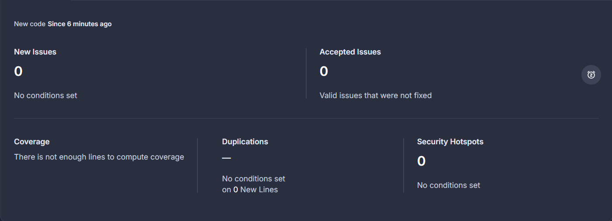

# devops-livecoding

base for GitHub Actions

## 2-1 What are testcontainers?

Testcontainers is a library that allows developers to run Docker containers within their test code, creating isolated environments for integration testing. It provides easy setup of databases, web servers, and other dependencies, ensuring consistent and reproducible tests across different environments.

## 2-2 Document your github actions configuration 

### Trigger Conditions

The workflow is configured to run under the following conditions:

- **On Push**: Executes on pushes to the `main` and `develop` branches.
- **On Pull Request**: Runs automatically when a pull request is created, ensuring code changes are tested before merging.

### Job Details: `test-backend`

The `test-backend` job carries out the essential steps for building and testing the Java application.

- **Runs-on**: `ubuntu-22.04` - Specifies the OS environment for running the job, ensuring a consistent Linux-based platform.

#### Steps Explained

1. **Checkout Repository**:
    - **Action Used**: `actions/checkout@v2.5.0`
    - **Purpose**: Checks out the repository code, making it available for subsequent steps in the workflow.

2. **Set up JDK 17**:
    - **Action Used**: `actions/setup-java@v3`
    - **Purpose**: Installs and configures JDK 17 (Amazon Corretto distribution) as the Java environment.
    - **Parameters**:
        - `distribution`: Specifies the JDK distribution, here set to `'corretto'`.
        - `java-version`: Specifies the version, here set to `'17'`.

3. **Build and Test with Maven**:
    - **Command**: `mvn clean install`
    - **Purpose**: Runs Maven to build the project and execute tests. The `mvn clean install` command first cleans any previous builds and then builds the project and runs tests.
    - **Working Directory**: `simple-api` - Ensures Maven commands are run in the specified project directory (`simple-api`).

## For what purpose do we need to push docker images?

Pushing Docker images allows you to upload your locally built images to a remote repository, such as Docker Hub or a private registry, making them accessible for deployment across different environments or by other team members. This practice ensures version control, easy distribution, and scalability of applications within containerized environments.

## Document your quality gate configuration.



This quality gate configuration shows no new issues, accepted issues, or security hotspots in the analyzed code, indicating no conditions have been set to flag concerns in these areas. Additionally, it reports insufficient lines of code to compute coverage, and there are no code duplications detected

# TP ANSIBLE

## Document your inventory and base commands

Global Variables (vars):
	- **ansible_user"**: Sets the user (admin) that Ansible will use to SSH into the target hosts.
	- **ansible_ssh_private_key_file**: Specifies the file path for the SSH private key used for authentication.
	
Groups:
	- **prod**: Defines a group named prod under children.
	- **Hosts**: Contains the list of target servers (e.g., hostname or IP address) that belong to the prod environment.
	
This configuration helps Ansible know which hosts to connect to and how to authenticate for the prod environment.

Commande Ansible :
ansible all -i inventories/setup.yml -m setup -a "filter=ansible_distribution*"

   - ansible all: Runs the command against all hosts defined in the specified inventory file. 
   - -i inventories/setup.yml: Points to the inventory file (setup.yml) that defines the hosts and connection details. 
   - -m setup: Uses the setup module, which gathers system facts about the remote hosts, such as OS details, network information, and hardware specs. 
     - -a "filter=ansible_distribution*": Filters the gathered facts to only show those related to ansible_distribution, which typically includes:
      ansible_distribution: The name of the OS distribution (e.g., "Ubuntu").
      ansible_distribution_version: The version of the distribution (e.g., "20.04").
      ansible_distribution_release: The code name or release name of the distribution (e.g., "focal" for Ubuntu 20.04).

## 3-2 Document your playbook


## Tasks Overview

### 1. Install Prerequisites for Docker
```yaml
- name: Install required packages
  apt:
    name:
      - apt-transport-https
      - ca-certificates
      - curl
      - gnupg
      - lsb-release
      - python3-venv
    state: latest
    update_cache: yes
```
**Description**: Installs essential packages required for Docker installation, ensuring the package cache is updated.

### 2. Add Docker’s Official GPG Key
```yaml
- name: Add Docker GPG key
  apt_key:
    url: https://download.docker.com/linux/debian/gpg
    state: present
```
**Description**: Adds Docker's official GPG key to verify the integrity of the packages.

### 3. Set Up the Docker Stable Repository
```yaml
- name: Add Docker APT repository
  apt_repository:
    repo: "deb [arch=amd64] https://download.docker.com/linux/debian {{ ansible_facts['distribution_release'] }} stable"
    state: present
    update_cache: yes
```
**Description**: Configures the Docker APT repository to allow installation of Docker packages.

### 4. Install Docker
```yaml
- name: Install Docker
  apt:
    name: docker-ce
    state: present
```
**Description**: Installs the Docker Community Edition (CE) package.

### 5. Install Python3 and pip3
```yaml
- name: Install Python3 and pip3
  apt:
    name:
      - python3
      - python3-pip
    state: present
```
**Description**: Installs Python 3 and the pip package manager for Python.

### 6. Create a Virtual Environment for Python Packages
```yaml
- name: Create a virtual environment for Docker SDK
  command: python3 -m venv /opt/docker_venv
  args:
    creates: /opt/docker_venv  # Only runs if this directory doesn’t exist
```
**Description**: Creates a virtual environment for installing the Docker SDK for Python, ensuring it only runs if the environment does not already exist.

### 7. Install Docker SDK for Python in the Virtual Environment
```yaml
- name: Install Docker SDK for Python in virtual environment
  command: /opt/docker_venv/bin/pip install docker
```
**Description**: Installs the Docker SDK for Python within the created virtual environment.

### 8. Ensure Docker is Running
```yaml
- name: Make sure Docker is running
  service:
    name: docker
    state: started
```
**Description**: Ensures that the Docker service is started and running.

## Document your docker_container tasks configuration

1. Install docker and its dependencies

```yml
---
# Install prerequisites for Docker
- name: Install required packages
  apt:
    name:
      - apt-transport-https
      - ca-certificates
      - curl
      - gnupg
      - lsb-release
      - python3-venv
    state: latest
    update_cache: yes

# Add Docker’s official GPG key
- name: Add Docker GPG key
  apt_key:
    url: https://download.docker.com/linux/debian/gpg
    state: present

# Set up the Docker stable repository
- name: Add Docker APT repository
  apt_repository:
    repo: "deb [arch=amd64] https://download.docker.com/linux/debian {{ ansible_facts['distribution_release'] }} stable"
    state: present
    update_cache: yes

# Install Docker
- name: Install Docker
  apt:
    name: docker-ce
    state: present

# Install Python3 and pip3
- name: Install Python3 and pip3
  apt:
    name:
      - python3
      - python3-pip
    state: present

# Create a virtual environment for Python packages
- name: Create a virtual environment for Docker SDK
  command: python3 -m venv /opt/docker_venv
  args:
    creates: /opt/docker_venv  # Only runs if this directory doesn’t exist

# Install Docker SDK for Python in the virtual environment
- name: Install Docker SDK for Python in virtual environment
  command: /opt/docker_venv/bin/pip install docker

# Ensure Docker is running
- name: Ensure Docker is running
  service:
    name: docker
    state: started
  tags: docker
```


2. Create docker network

```yml
- name: Create Docker network
  community.docker.docker_network:
    name: my-network
    state: present
```


3. Launch database

```yml
- name: Run Database
  community.docker.docker_container:
    name: my-db
    image: azekyo/tp-devops-database
    env:
      POSTGRES_DB: db
      POSTGRES_USER: user
      POSTGRES_PASSWORD: pwd
    networks:
      - name: my-network
    volumes:
      - db-volume:/var/lib/postgresql/data
    state: started
```


4. Launch application

```yml
- name: Run Backend Application
  community.docker.docker_container:
    name: my-api
    image: azekyo/tp-devops-api	
    env:
      DATABASE_HOST: my-db  # Name of the database container
      DATABASE_PORT: "5432"  # Default PostgreSQL port
      POSTGRES_DB: db
      POSTGRES_USER: user
      POSTGRES_PASSWORD: pwd
    networks:
      - name: my-network
    state: started
```


5. Launch proxy

```yml
- name: Run Proxy
  community.docker.docker_container:
    name: httpd
    image: azekyo/tp-devops-httpd	
    ports:
      - "80:80"
    networks:
      - name: my-network
    state: started
```


6. Run the playbook


```bash
ansible-playbook -i inventories/setup.yml playbook.yml
```